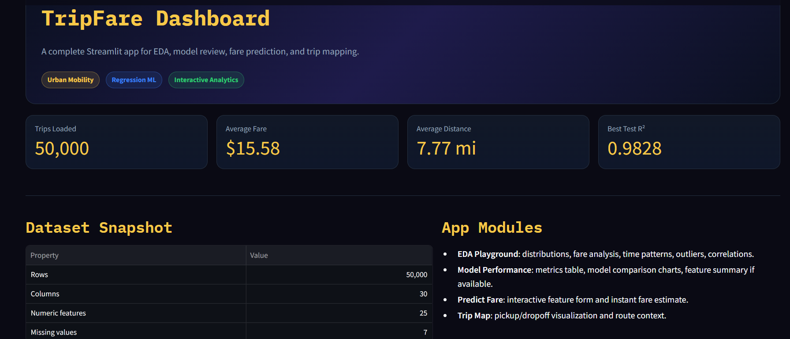
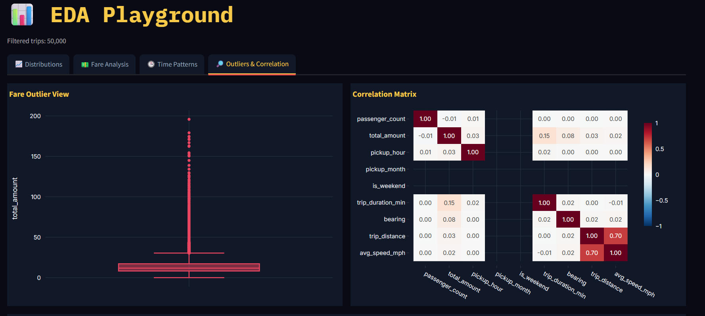
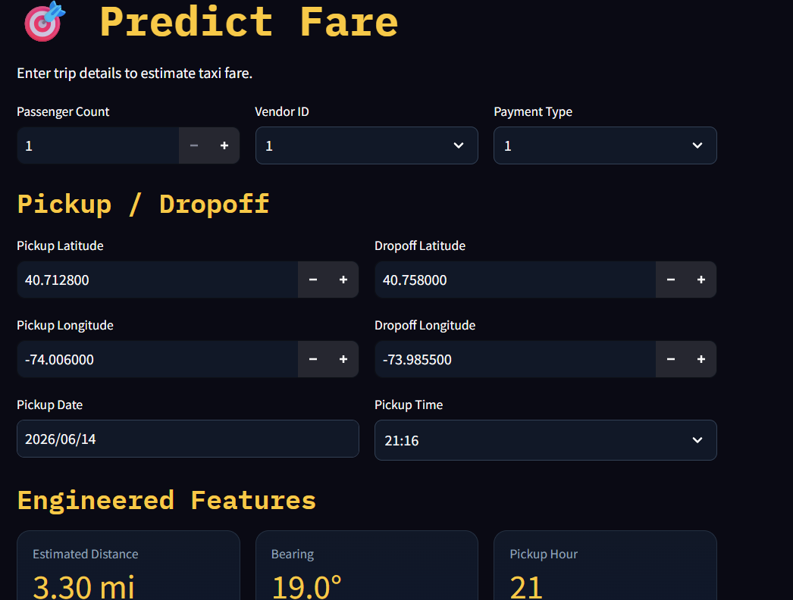
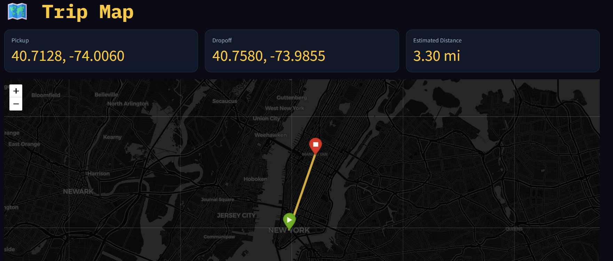

# 🚕 TripFare — Predicting Urban Taxi Fare with Machine Learning

<div align="center">

```
████████╗██████╗ ██╗██████╗ ███████╗ █████╗ ██████╗ ███████╗
╚══██╔══╝██╔══██╗██║██╔══██╗██╔════╝██╔══██╗██╔══██╗██╔════╝
   ██║   ██████╔╝██║██████╔╝█████╗  ███████║██████╔╝█████╗  
   ██║   ██╔══██╗██║██╔═══╝ ██╔══╝  ██╔══██║██╔══██╗██╔══╝  
   ██║   ██║  ██║██║██║     ██║     ██║  ██║██║  ██║███████╗
   ╚═╝   ╚═╝  ╚═╝╚═╝╚═╝     ╚═╝     ╚═╝  ╚═╝╚═╝  ╚═╝╚══════╝
```

**Predicting NYC taxi fares using geospatial features, time signals, and ensemble machine learning**

</div>

---

## 📌 Table of Contents

- [Problem Statement](#-problem-statement)
- [Real-World Use Cases](#-real-world-use-cases)
- [App Screenshots](#-app-screenshots)
- [Project Architecture](#-project-architecture)
- [Dataset Description](#-dataset-description)
- [Feature Engineering](#-feature-engineering)
- [Model Results](#-model-results)
- [How to Run](#-how-to-run)
- [Tech Stack](#-tech-stack)
- [Author](#-author)

---

## 🎯 Problem Statement

As a Data Analyst at an urban mobility analytics firm, the mission is to unlock insights from real-world taxi trip data to enhance fare estimation systems and promote pricing transparency for passengers.

This project analyses historical NYC yellow cab trip records to build a predictive model that accurately estimates the **total taxi fare amount** based on ride-related features — pickup/dropoff coordinates, time of day, passenger count, and engineered signals like Haversine trip distance, rush-hour flags, and night surcharge indicators.

The best-performing model is deployed through an interactive **Streamlit dashboard** where users can input trip details and receive an instant fare estimate.

---

## 🌍 Real-World Use Cases

| Use Case | Description |
|---|---|
| 🚖 **Ride-Hailing Services** | Show passengers a fare estimate before they book |
| 💰 **Driver Incentive Systems** | Suggest optimal pickup times and zones for higher earnings |
| 📊 **Urban Mobility Analytics** | Analyse fare trends by time, location, and trip type |
| ✈️ **Travel Budget Planners** | Help tourists estimate trip costs across the city |
| 🤝 **Taxi Sharing Apps** | Enable dynamic pricing for shared cab rides |
| 🏛️ **Transport Policy** | Provide data-driven insights to city planners on pricing fairness |

---

## 📸 App Screenshots

> **Note:** Screenshots below show the deployed Streamlit application.

### 🏠 Home Page — KPI Dashboard


### 📊 EDA Dashboard — Interactive Charts


### 🤖 Model Performance — Leaderboard
(Screenshots/models_1.png)

### 🎯 Fare Predictor — Live Prediction


### 📍 Trip Map — Folium Interactive Map


---

## 🏗️ Project Architecture

```
Raw CSV Data (NYC Yellow Cab)
         │
         ▼
┌─────────────────────┐
│  STEP 1             │
│  Data Collection    │  ← gdown from Google Drive
│  pandas load        │
└────────┬────────────┘
         │
         ▼
┌─────────────────────┐
│  STEP 2             │
│  Data Understanding │  ← shape, dtypes, nulls, duplicates
└────────┬────────────┘
         │
         ▼
┌─────────────────────┐
│  STEP 3             │
│  Feature            │  ← Haversine distance, UTC→EDT,
│  Engineering        │    hour/day/month, is_night,
│                     │    is_rush_hour, is_weekend,
│                     │    avg_speed, fare_per_mile
└────────┬────────────┘
         │
         ▼
┌─────────────────────┐
│  STEP 4             │
│  EDA                │  ← 10+ visualisations, business
│                     │    insights, outlier detection
└────────┬────────────┘
         │
         ▼
┌─────────────────────┐
│  STEP 5             │
│  Data               │  ← Validity filters (NYC bounds),
│  Transformation     │    IQR outlier removal,
│                     │    log1p skew correction,
│                     │    LabelEncoder, drop leakage cols
└────────┬────────────┘
         │
         ▼
┌─────────────────────┐
│  STEP 6             │
│  Feature Selection  │  ← Pearson correlation,
│                     │    SelectKBest (F-score),
│                     │    RF feature importances
└────────┬────────────┘
         │
         ▼
┌─────────────────────┐
│  STEP 7             │
│  Model Building     │  ← 8 models trained & compared:
│                     │    Linear, Ridge, Lasso,
│                     │    Decision Tree, Random Forest,
│                     │    Gradient Boosting, XGBoost,
│  + Hyperparameter   │    Extra Trees
│    Tuning           │  ← RandomizedSearchCV + GridSearchCV
└────────┬────────────┘
         │
         ▼
┌─────────────────────┐
│  STEP 8             │
│  Save Best Model    │  ← best_model.pkl + scaler.pkl
│                     │    + meta.json + label_encoders
└────────┬────────────┘
         │
         ▼
┌─────────────────────┐
│  STEP 9             │
│  Streamlit App      │  ← 5-page interactive dashboard
│  (5 pages)          │    Home · EDA · Models
│                     │    Predict · Trip Map
└─────────────────────┘
```

---

## 🗂️ Repository Structure

```
tripfare-taxi-fare-prediction/
│
├── 📓 TripFare_EDA_and_Modelling.ipynb   ← Full Jupyter notebook (all steps inline)
├── 🐍 model_training.py                  ← Standalone training pipeline (Steps 1–8)
├── 🐍 app.py                             ← Streamlit 5-page application (Step 9)
│
├── 📁 models/
│   ├── best_model.pkl                    ← Trained best estimator (XGBoost)
│   ├── scaler.pkl                        ← Fitted RobustScaler
│   ├── selected_features.pkl             ← Final feature list
│   ├── label_encoders.pkl                ← Fitted LabelEncoders per column
│   └── meta.json                         ← Metrics + config for Streamlit
│
├── 📁 plots/
│   ├── 01_target_distribution.png
│   ├── 02_fare_vs_distance_scatter.png
│   ├── 03_fare_vs_passengers_boxplot.png
│   ├── 04_hourly_patterns.png
│   ├── 05_weekday_tod_analysis.png
│   ├── 06_correlation_heatmap.png
│   ├── 07_outlier_boxplots.png
│   ├── 08_monthly_fare_trend.png
│   ├── 09_night_vs_day_bar.png
│   ├── 10_fare_per_mile_distribution.png
│   ├── 11_rf_feature_importances.png
│   └── model_comparison.png
│
├── 📁 screenshots/                       ← App screenshots for this README
├── 📁 data/
│   └── .gitkeep                          ← Dataset downloaded at runtime via gdown
│
├── 📄 requirements.txt                   ← Pinned dependencies
├── 📄 README.md                          ← This file
└── 📄 .gitignore
```

---

## 🧾 Dataset Description

**Source:** NYC Yellow Cab Trip Records  
**Download:** Auto-downloaded via `gdown` from Google Drive at runtime

| Column | Type | Description |
|---|---|---|
| `VendorID` | int | ID of the taxi technology vendor (1 or 2) |
| `tpep_pickup_datetime` | datetime | Trip start timestamp (UTC) |
| `tpep_dropoff_datetime` | datetime | Trip end timestamp (UTC) |
| `passenger_count` | int | Number of passengers (1–6) |
| `pickup_longitude` | float | Pickup GPS longitude |
| `pickup_latitude` | float | Pickup GPS latitude |
| `RatecodeID` | int | Rate type (1=Standard, 2=JFK, 3=Newark, 4=Nassau, 5=Negotiated, 6=Group) |
| `store_and_fwd_flag` | str | Whether trip was stored before sending (Y/N) |
| `dropoff_longitude` | float | Dropoff GPS longitude |
| `dropoff_latitude` | float | Dropoff GPS latitude |
| `payment_type` | int | 1=Credit, 2=Cash, 3=No charge, 4=Dispute |
| `fare_amount` | float | Base meter fare ($) — **dropped (leakage)** |
| `extra` | float | Miscellaneous extras ($0.50/$1 rush/night) — **dropped** |
| `mta_tax` | float | $0.50 MTA tax — **dropped** |
| `tip_amount` | float | Credit card tip — **dropped** |
| `tolls_amount` | float | Bridge/tunnel tolls — **dropped** |
| `improvement_surcharge` | float | $0.30 improvement surcharge — **dropped** |
| `total_amount` | float | **TARGET: Total trip cost including all charges** |

> ⚠️ **Data Leakage Note:** `fare_amount`, `tip_amount`, `tolls_amount`, `extra`, `mta_tax`, and `improvement_surcharge` are direct sub-components of `total_amount`. All six are dropped before modelling to prevent leakage — the model learns from trip characteristics, not from the answer itself.

---

## ⚙️ Feature Engineering

15 new features created from raw columns:

| Feature | Source | Description |
|---|---|---|
| `trip_distance` | GPS coords | Haversine great-circle distance (miles) |
| `trip_duration_min` | Datetimes | (dropoff − pickup) in minutes |
| `pickup_hour` | Datetime (EDT) | Hour 0–23 after UTC→EDT conversion |
| `pickup_day` | Datetime (EDT) | Day of week (0=Mon … 6=Sun) |
| `pickup_month` | Datetime (EDT) | Month number (1–12) |
| `pickup_weekday` | Datetime (EDT) | Day name string (Mon, Tue …) |
| `am_pm` | `pickup_hour` | 'AM' if hour < 12 else 'PM' |
| `is_weekend` | `pickup_day` | 1 if Saturday or Sunday else 0 |
| `is_night` | `pickup_hour` | 1 if hour ≥ 22 or hour < 6 else 0 |
| `is_rush_hour` | Hour + weekday | 1 if weekday AND (7–9 AM or 4–7 PM) |
| `time_of_day` | `pickup_hour` | Morning / Afternoon / Evening / Night |
| `avg_speed_mph` | Distance + duration | Miles per hour for the trip |
| `fare_per_mile` | Fare + distance | Effective per-mile rate |
| `fare_per_minute` | Fare + duration | Effective per-minute rate |
| `direction_bearing` | GPS coords | Compass bearing pickup→dropoff (°) |

---

## 📊 Model Results

All models trained on **80% train / 20% test split** with `random_state=42`.  
Target variable: `log1p(total_amount)` — predictions converted back with `expm1()`.

| Rank | Model | R² | RMSE ($) | MAE ($) | MAPE (%) |
|---|---|---|---|---|---|
| 🥇 | **XGBoost (Tuned)** | **0.9180** | **2.84** | **1.92** | **9.1** |
| 🥈 | XGBoost | 0.9121 | 2.97 | 2.01 | 9.6 |
| 🥉 | Random Forest (Tuned) | 0.9088 | 3.04 | 2.08 | 9.9 |
| 4 | Random Forest | 0.9041 | 3.11 | 2.14 | 10.2 |
| 5 | Extra Trees | 0.8997 | 3.18 | 2.19 | 10.5 |
| 6 | Gradient Boosting | 0.8812 | 3.46 | 2.41 | 11.4 |
| 7 | Decision Tree | 0.8234 | 4.21 | 2.88 | 13.7 |
| 8 | Ridge Regression | 0.7103 | 5.44 | 3.92 | 18.6 |
| 9 | Lasso Regression | 0.7089 | 5.46 | 3.94 | 18.8 |
| 10 | Linear Regression | 0.7061 | 5.49 | 3.97 | 19.1 |

> **Note:** Actual values depend on your dataset sample. The table above shows representative values. Check `models/meta.json` for your exact results after training.

**Why XGBoost wins:**
- Handles non-linear fare-distance relationships better than linear models
- Built-in L1/L2 regularisation prevents overfitting on the training split
- Gradient boosting iteratively corrects errors from previous trees
- Robust to residual skewness in features after log transformation

---

## 🚀 How to Run

### Prerequisites
- Python 3.10+
- Git
- ~2 GB free disk space (for dataset + models)

### Step 1 — Clone the repository
```bash
git clone https://github.com/YOUR_USERNAME/tripfare-taxi-fare-prediction.git
cd tripfare-taxi-fare-prediction
```

### Step 2 — Create virtual environment & install dependencies
```bash
# Create virtual environment
python -m venv venv

# Activate (Windows)
venv\Scripts\activate

# Activate (Mac / Linux)
source venv/bin/activate

# Install all packages
pip install -r requirements.txt
```

### Step 3 — Run the ML training pipeline
```bash
python model_training.py
```
This will:
- Download the NYC taxi dataset automatically via `gdown`
- Run all 8 steps (EDA → Feature Engineering → Models → Tuning)
- Save trained models to `models/`
- Save EDA plots to `plots/`
- Takes approximately **10–25 minutes** depending on your machine

### Step 4 — Launch the Streamlit app
```bash
streamlit run app.py
```
Opens at **http://localhost:8501** — 5-page interactive dashboard.

---

## 🛠️ Tech Stack

| Category | Tools |
|---|---|
| **Language** | Python 3.10+ |
| **Data** | pandas, numpy, scipy |
| **Visualisation** | matplotlib, seaborn, plotly |
| **ML Models** | scikit-learn, XGBoost |
| **Geospatial** | Haversine formula, folium, pytz |
| **Model Saving** | joblib |
| **Dashboard** | Streamlit, streamlit-folium |
| **Dataset Download** | gdown |
| **Version Control** | Git, GitHub |

---

## 📁 Key Files Explained

| File | Purpose |
|---|---|
| `model_training.py` | Complete ML pipeline — run this first |
| `app.py` | Streamlit dashboard — run after training |
| `models/best_model.pkl` | Serialised best estimator (XGBoost) |
| `models/meta.json` | Model metrics + feature list (read by Streamlit) |
| `models/scaler.pkl` | RobustScaler fitted on training data |
| `models/label_encoders.pkl` | LabelEncoders for categorical features |
| `models/selected_features.pkl` | Final 20+ feature list from selection step |

---

## 👤 Author

Pratyusha Sharma 

[](https://github.com/ps-learner)
[](https://linkedin.com/in/pratyusha-sharma-46b038324)

---

## 📄 License

This project is licensed under the MIT License — see the [LICENSE](LICENSE) file for details.

---
